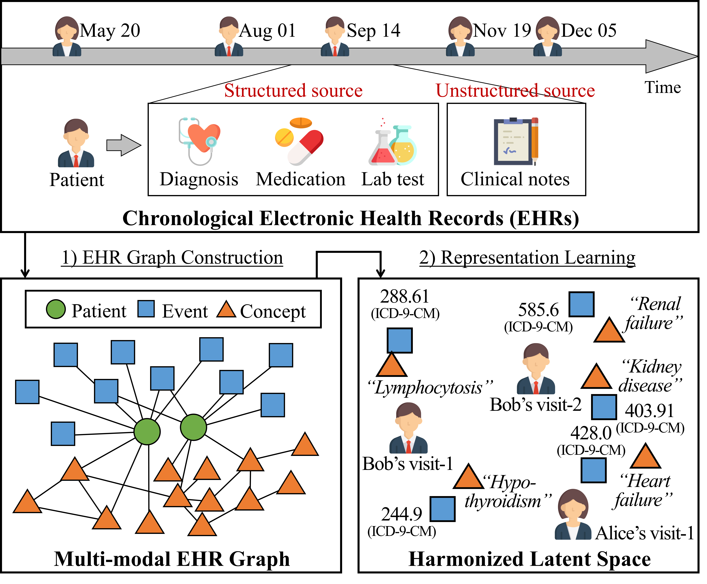
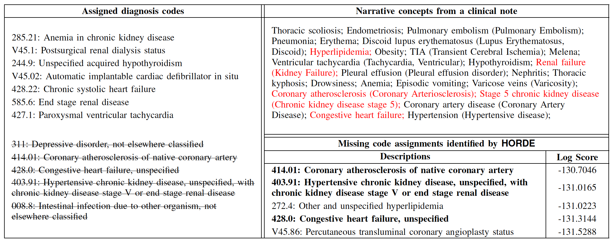

# HORDE

- This is a Tensorflow implementation of ["Harmonized Representation Learning on Dynamic EHR Graphs"](https://www.sciencedirect.com/science/article/pii/S153204642030054X?via%3Dihub), published in Journal of Biomedical Informatics 2020. 
- The PyTorch implementation is available at <https://github.com/Lishany/HORDE-pytorch>.

## Overview

<p align="center">

</p>

> The overview of harmonized representation learning on the EHR. The overall process consists of two parts: **1) multi-modal EHR graph construction**, and **2) graph representation learning**.


## Running the Code
#### Step 1. Installing Python and Tensorflow

- Install `Python 3`. (numpy, scipy, and sklearn packages are required as well.)
- Install `tensorflow-gpu` docker. You can easily pull it from the NVIDIA cloud by the following pull command:
```
  docker pull nvcr.io/nvidia/tensorflow:19.01-py3
```
  - Please use **tensorflow 1.x**, or modifiy the codes so that it can be running on tensorflow >= 2.0.

#### Step 2. Preparing Data

- You need .npy (numpy file format) file of EHR.
- It should be in the form of numpy array, which includes the list of visits.
- Each visit has to contain `patient id`, `visit id`, `diagnosis code list`, and `NLP concept list`.
  - For example,
```
  [[3, 1, ['460', '460.1'], ['Anorexia', 'Hypertensive disease']],
  [3, 2, ['V70.0', '625.9'], ['Hepatitis', 'Hepatitis', 'Vaginitis']],
  ...,
  [3243123, 5, ['512.1', '518.0'], ['Atelectasis', 'Pneumonia', 'Pneumothorax']]]
```
- You do not need to enforce visit-ids unique. They do not matter to run the codes.
- Multiple visits of a single patient do not have to be consecutive, but they should be sorted in a chronological order.
- Diagnosis codes and NLP concepts must be provided as string format.
- NLP concepts should preserve their order in original clinical notes, and they can occur multiple times in the list.
- Run the script for data preprocessing by the following command:
```
  python process_data.py <input_numpy_file> <output_directory> <test_patients_number>
```
- Test patients are used to evaluate the representation quality.
- Then, three files would be created in the output directory; `graph.npy`, `ctxpairs.npy`, and `patients.npy`.

#### Step 3. Running HORDE on your Data

Now, you are ready to learn the representations of medical entities based on `HORDE`.

* if you want to use CPU
```
  python main.py --input_dir <input_directory> --output_dir <output_directory>
```
* if you want to use GPU (GPU:0 is used unless gpu_devidx is specified)
```
  python main.py --gpu True --gpu_devidx <GPU_device_index> --input_dir <input_directory> --output_dir <output_directory>
```

These are additional possible arguments you can specify:

Argument | Description
--- | ---
--input_dir | The path to the input nummpy files (the output directory at the step 2)
--output_dir | The path to the output embedding numpy files
--vector_size | The size of the final representation vectors (default: 256)
--negsample_size | The number of negative context pairs per positive context pair (default: 1)
--learning_rate | The initial learning rate for the ADMM optimizer (default: 0.001)
--ti_dropout | The dropout rate for time-invariant node vectors (default: 0.3)
--tv_dropout | The dropout rate for time-variant node vectors (default: 0.3)
--ti_batch_size | The size of a single mini-batch for time-invariant node pairs (default: 512)
--tv_batch_size | The size of a single mini-batch for time-variant node sequences (default: 32)
--weight_decay | The coefficient of L2 regularization on all the weight parameters (default: 0.001)
--n_iters | The total number of mini-batches for training (default: 200,000)
--n_printiters | The number of mini-batches for evaluating the model and printing outputs (default: 2,000)
--recall_at | The k value in Recall@k for subsequent event prediction (default: 30)


#### Step 4. Tuning the Hyperparameters

We strongly recommend to tune the following hyperparameters, whose combination affects the quality of representations.
- --ti_batch_size &isin; {128, 256, 512}
- --tv_batch_size &isin; {16, 32, 64}

## EHR Analysis

- Using the representations obtained by `HORDE`:
  - we can identify less consistent code assignments (i.e., more likely to be erroneous) from the visits of a patient.
  - we can infer missing codes for each visit by retrieving the codes that are not assigned but have high scores.

<p align="center">

</p>

> A detailed example of our consistency analysis on deletion-type noises (N = 5, MIMIC-III). 
The left column is the list of assigned codes in a target visit, and strike-through texts represent randomly deleted code assignments. 
The upper part of the right column shows all narrative concepts extracted from a discharge summary of the visit, and the lower part is the identification result of N missing codes by the highest confidence scores from `HORDE`. 

## Citation
Dongha Lee, Xiaoqian Jiang, and Hwanjo Yu. "Harmonized Representation Learning on Dynamic EHR Graphs", Joural of Biomedical Informatics, 2020.
```
@article {lee2020harmonized,
  title = {Harmonized representation learning on dynamic EHR graphs},
  author = {Lee, Dongha and Jiang, Xiaoqian and Yu, Hwanjo},
  volume = {106},
  year = {2020},
  journal = {Journal of biomedical informatics},
  pages = {103426}
}
```
